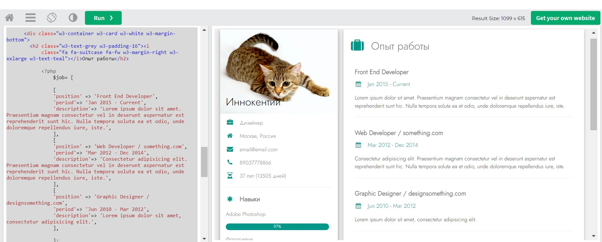
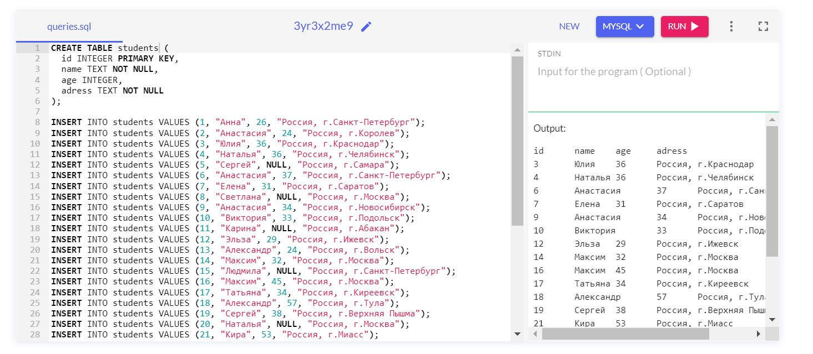

# *Знакомство с веб-технологиями* #
### **Домашнее задание к семинару 4:** ### 

**Задача №1:** сформировать массив с данными для блока «Опыт работы».
Вывести данные массива в HTML-шаблоне.\

**Решение:** разместила весь код с моей вставкой в файле commonCode.php.\
Мой кусок вставки про "Опыт работы "для удобства проверки в файле z1.php.

Вот как выглядит вывод в  w3schools.com:

**Задача №2:** создать БД, состоящую из одной таблицы (информация об одногруппниках) с четырьмя полями (добавить поле «Адрес»): id, name, age, address.

**Решение:** вот, что выдал MySQL на запрос :

"SELECT * FROM students WHERE age > 26;

Прилагаю полностью Output в MySQL:

id	name	age	adress\
3	Юлия	36	Россия, г.Краснодар\
4	Наталья	36	Россия, г.Челябинск\
6	Анастасия	37	Россия, г.Санкт-Петербург\
7	Елена	31	Россия, г.Саратов\
9	Анастасия	34	Россия, г.Новосибирск\
10	Виктория	33	Россия, г.Подольск\
12	Эльза	29	Россия, г.Ижевск\
14	Максим	32	Россия, г.Москва\
16	Максим	45	Россия, г.Москва\
17	Татьяна	34	Россия, г.Киреевск\
18	Александр	57	Россия, г.Тула\
19	Сергей	38	Россия, г.Верхняя Пышма\
21	Кира	53	Россия, г.Миасс\
22	Денис	40	Россия, г.Новосибирск\
23	Вячеслав	32	Россия, г.Новосибирск\
26	Александр	51	Россия, г.Санкт-Петербург\
27	Алексей	39	Россия, г.Чебоксары\
28	Руслан	36	Россия, г.Челябинск\
31	Зухра	29	Россия, г.Сарманово